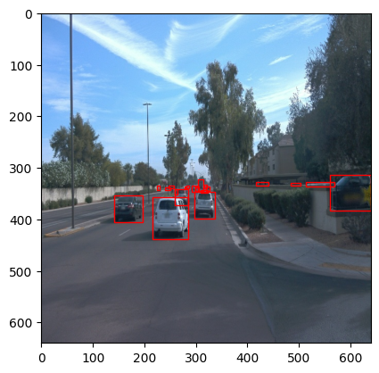
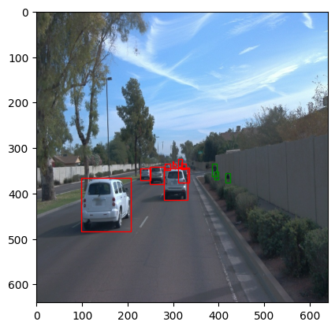
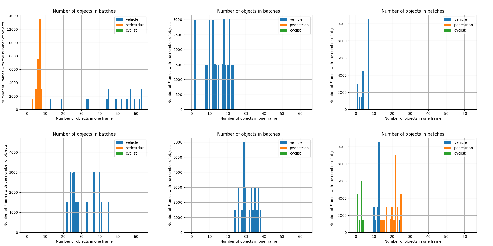
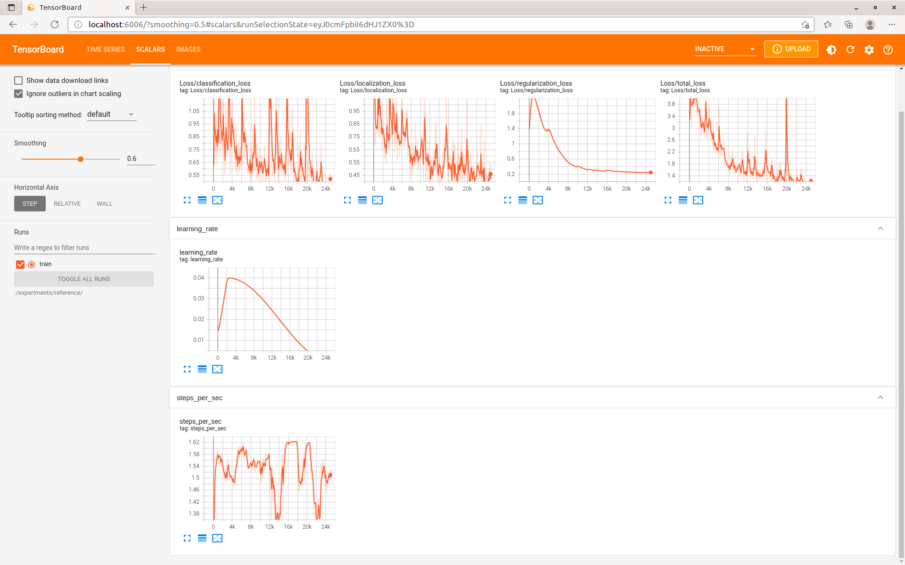
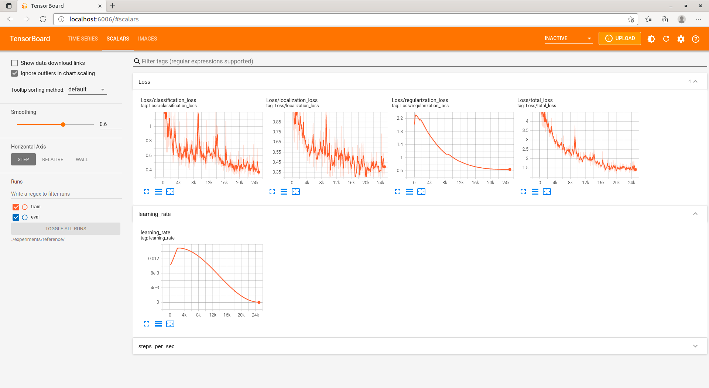
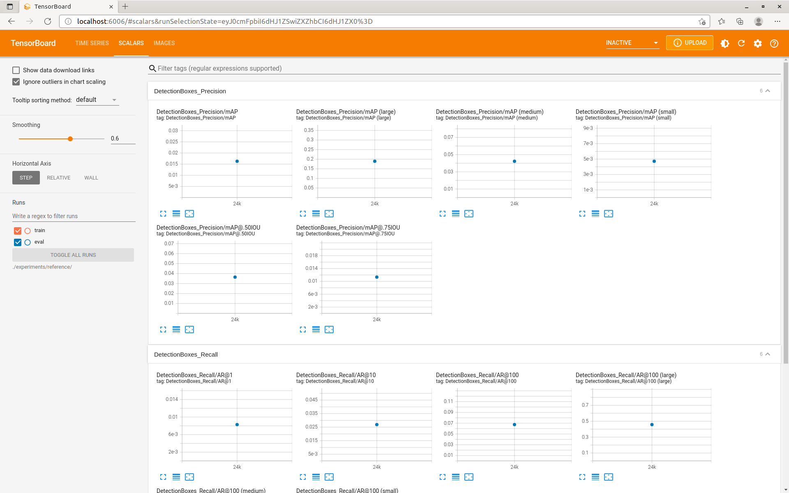
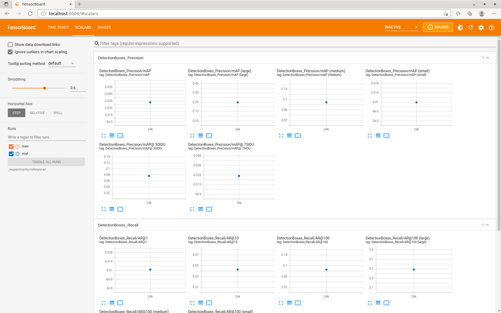

# Overview

As the eyes are an important method of perception in driving, camera based methods of object detection is also crucial in automonous driving perception. It can recognize other vehicles, depestrians, signs and lane markings with optical textures. With relatively low price, it also provide good detections in near field under proper conditions (such as lighting and weather).

In this project, Single-Shot-Detection method is trained and tested.

# Setup

Docker container is used in this project as virtualization method, to provide a safe and unified working environment for machine learning.

1. build the container with modified Dockerfile, there a normal user is created so that the generated files can be accessed also outside of container: `docker build -t project-dev -f Dockerfile --build-arg UID=$(id -u) --build-arg GID=$(id -g) --build-arg UNAME=$(whoami) .` in `build` directory.
2. login in gcloud and run `python ./download_process.py --data_dir ./data` in directory `/app/project`.
3. Split data with `python create_splits.py --source ./data/processed --destination ./data` and download the pretrained model.
4. Change config to use the real data `./_edit_config.sh`. The original config is saved as "pipeline.config.backup", and can be restored.
5. Train with `./_train.sh`, export model with `./_evaluate.sh`, and inference with some tfrecord from test.

# Dataset

The dataset contains a variation of traffic scenes, such as scenarios with parked cars and pedestrans.

However, the number of different types are very biased. Below is the distribution of different object types in six train tfrecords (subset).

It can be observed that the number of vehicles is dominent, compared with the other two types. There are also many more frames with only vehicles. It is meaningful for the data capture, as many streets are not suited for pedestrians and bicycles; but for the model training. it may make the prediction of pedestrians and bicycles bad. If it would be observed, the data will need to be balanced between data types.

The analysis can be reproduced with script analyze_data.py.

During the training, cross-validation is used for overfitting checking. The dataset is randomly shuffled, then 10 tfrecords are chosen as test data. The reason for chosing 10 files is that we only require very detailed evaluation on the model, which is usually the purpose of test data. When the performance of the model is desired for real-world-use, then I would prefer to have 10-20% of the whole dataset as test data. Then I put 70% of the rest of data as training data, and the rest as validation data. The three parts are randomly chosen and without repetition, to avoid hidding of overfitting and biased evaluation.

# Training

## Training with original pipeline config

The training with the original pipeline config was unexpectedly noisy and with rising loss at the beginning.
After around 4k steps, the losses start to reduce constantly. However, there was still a sudden rise of classification loss.

The result of several frames was as below. We can see that many vehicles are false negatives and not detected.

## Modification of the config

The biggest trouble of the training session would be the rise of regularization loss and bouncing other losses. I assume the learning rate is still too big, thus changed from 0.04-0.013333 to 0.015-0.01.

The reason for missing detection might be the scarcity of training data variation. Thus I added more augmentation, including
- random_image_scale
- random_black_patches
- random_crop_image (this one was an error)

Afterwards, the reduction of losses is more smooth and stable. However, the learning rate is too flat after around 10k steps, leading to little
improvement in the hyperparameters.

The result of several frames was as below. We can see that there are a lot of false positive and overlapping detection. The only good thing besides
lower false-negatives, is that most of the false positives are still one the vehicles (sometimes between them).

## Cross validation

Unfortunately cross validation could not be done in this project. Even though the validation data was correctly set in the pipeline, the
validation information could not be found on the board, before and after evaluation.

One potential reason is the issue in cocoapi library of using floating point number for indexing. Unfortunately I have found out this issue relatively late and using the corrected library for evaluation has not fixed it.

## Evaluation

Not only intuitively in the clips for animation, the modified pipeline has trained a network with more detections, but also the modified version
has better precision and recall.

- Evaluation before modification

- Evaluation after modification

## Analysis

In my trial to improve the trainig pipeline, I made two mistakes:
- the learning rate damps too fast, so that the latter half of training was effectless
- double image cropping, it might have damaged the training data
- the cocoapi issue was not discovered, it might be the reason why validation data was not available, thus the best iteration could not be chosen

The low learning rate has eased the increase of loss. Then, together with slower damping of learning rate, the model needs to be trained also
with more iterations.
